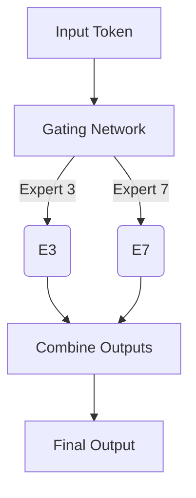
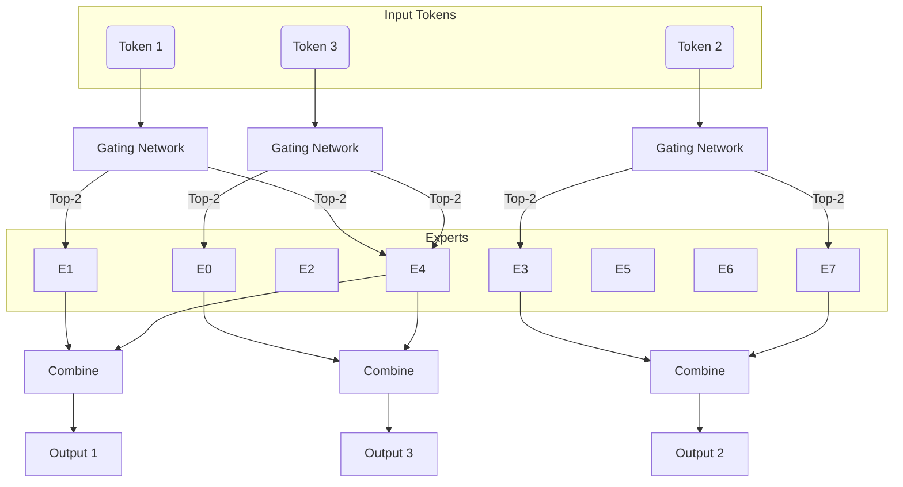
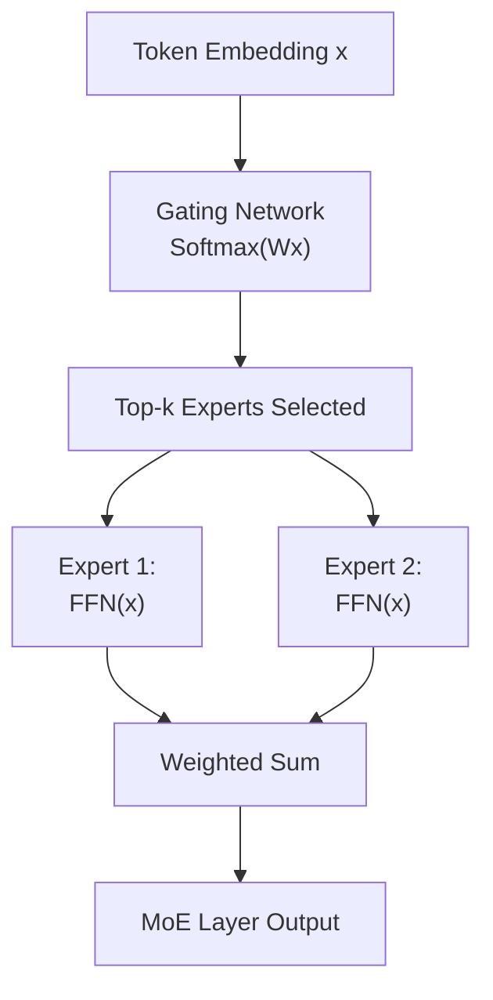
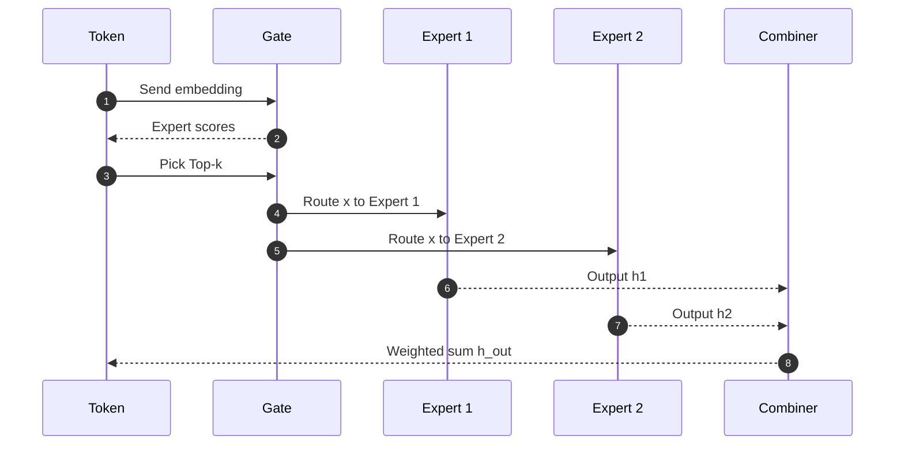
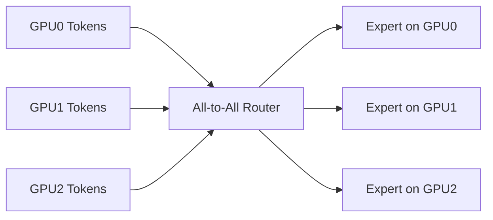

# 🧠 Mixture of Experts (MoE)

> **Goal:** Explain MoE in a way that a college student can understand — with diagrams, analogies, formulas, and real examples.

---

# ✅ **What is Mixture of Experts (MoE)?**

MoE is a type of neural network architecture where **different parts of the model specialize in different skills**, and a **gating network** decides which expert(s) should handle each input token.

Think of it like this:

➡️ **Instead of one big brain doing every task**,  
➡️ **you have many small brains (experts)**,  
➡️ And a **gate** picks the right experts for each problem.

---

# ✅ **Why do we use MoE?**

Large models (70B, 400B, 1T+ parameters) are expensive to run.

MoE allows:

✅ Models with **trillions** of parameters  
✅ But uses only **1–2%** of them per token  
✅ Faster inference  
✅ Lower memory cost  
✅ Better specialization

---

# ✅ The Core Idea (Illustration)



**Only 2 experts (e.g., E3 and E7) are used for this token**, not all experts.

---

# ✅ **Simplified Example (college-level)**

Let’s pretend:

- You have 10 experts.
- Each expert is good at something:
  - E0 = grammar expert  
  - E1 = math expert  
  - E2 = coding expert  
  - E3 = reasoning expert  
  - …

If the input token is:

```
"integrate"
```

The gating network might choose:

- Expert 1 (math)
- Expert 3 (reasoning)

Thus the model uses **only two out of ten experts** for this token.

---

# ✅ **MoE Architecture Overview**



---

# ✅ **Key Components of MoE**

### ✅ **1. Gating Network**
- Decides which experts to activate.
- Produces a **score** for each expert.

Mathematically:

```
gate_scores = softmax(Wx)
```

Where **x** = token embedding,  
and **W** = gating weight matrix.

### ✅ **2. Top-k Selection**
Choose the top-k experts (usually k = 1 or k = 2).

### ✅ **3. Experts**
Each expert is usually a **Feed-Forward Network (FFN)**.

So an MoE layer looks like:

```
x_out = Σ (gate_weight[i] · expert_i(x))
```

### ✅ **4. Router Loss**
Ensures tokens are *balanced* across experts so one expert does not get overloaded.

---

# ✅ **MoE Layer — Detailed Step-by-Step Flow**



---

# ✅ **Load Balancing Problem (Simple Explanation)**

If many tokens choose the same expert → that expert gets overloaded → slows down training/inference.

So we add:

✅ Load balancing loss  
✅ Token dropping rules  
✅ Capacity limits per expert  

To force all experts to get some work.

---

# ✅ **Routing Strategies**

### ✅ **Top-1 Routing**
Only choose **one** expert.

Pros:
- Fastest  
- Least communication  
Cons:
- Less expressive  

### ✅ **Top-2 Routing** (most common)
Choose **two** experts.

Pros:
- Better accuracy  
- Stable training  
Cons:
- More compute  

### ✅ **Top-k Routing**
Choosing more experts increases expressiveness.

---

# ✅ **End-to-End MoE Forward Pass**



---

# ✅ **Capacity & Token Routing**

Each expert has a **capacity limit**, like:

```
capacity = 1.25 * (total_tokens / num_experts)
```

If an expert is full:

- Extra tokens are **dropped**
- OR routed to another expert
- OR padded (depending on implementation)

---

# ✅ **Real-World MoE Models**

| Model | Experts | Top-k | Notes |
|-------|---------|--------|-------|
| **Google Switch Transformer** | 2048 | 1 | Very efficient |
| **GLaM** | 64 | 2 | Google’s 1.2T parameter model |
| **Mixtral 8x7B** | 8 | 2 | Open-source, very popular |
| **DeepSeek-MoE** | 16+ | 2 | State-of-the-art MoE design |

---

# ✅ **MoE vs Dense Models**

| Feature | Dense | MoE |
|--------|--------|--------|
| Params | Medium | Extremely large |
| Active Params per Token | High | Very low |
| Cost | High | Low |
| Flexibility | Medium | High (specialization) |
| Routing | No | Yes (gating) |

---

# ✅ **Advantages of MoE**

✅ Efficient for very large parameter counts  
✅ Better specialization → better reasoning  
✅ Faster than dense models of same size  
✅ Scales well with clusters (sharding per expert)

---

# ✅ **Disadvantages of MoE**

❌ Hard to train  
❌ Expert imbalance  
❌ Communication overhead across devices  
❌ Harder to optimize & schedule  
❌ Router instability  

---

# ✅ **MoE in LLM Inference (SGLang / vLLM)**

MoE introduces complexity in inference:

- Experts may live on **different GPUs / HPUs / XPUs**  
- Schedulers must route tokens to the right device  
- Requires **All-to-All communication**  
- Must maintain load balancing per decoding step  

---

# ✅ **All-to-All Communication — Why Needed**



Each device sends tokens to whichever device holds the expert.

---

# ✅ **Conclusion**

MoE is a powerful idea:

- Train huge models efficiently  
- Use only a small part per token  
- Enable trillion-parameter models  
- Great for large reasoning tasks  

But it comes with:

- Complex routing  
- Load balancing  
- Cross-device communication  
- Scheduling challenges  

---
