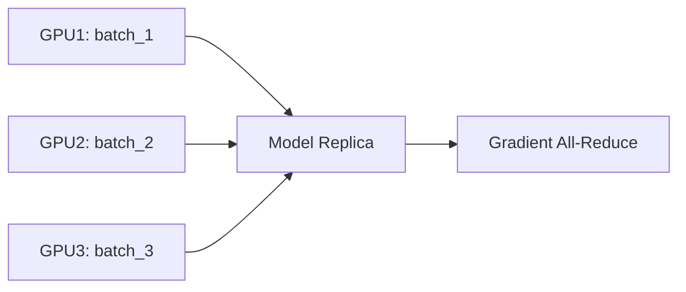
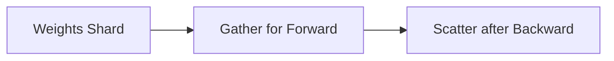
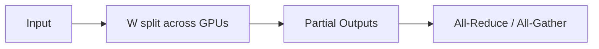
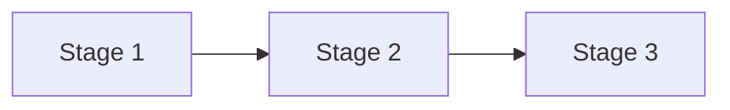
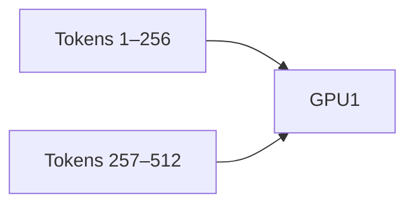
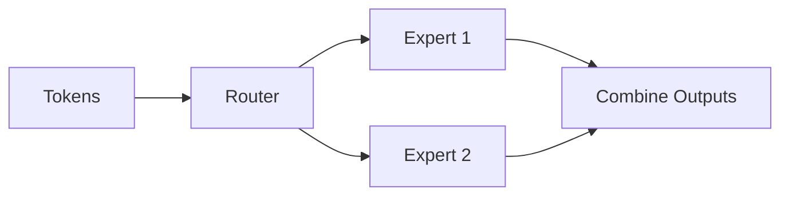
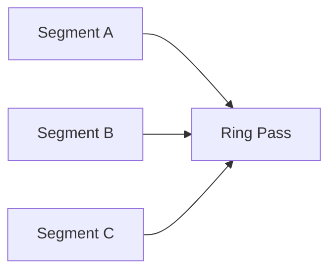
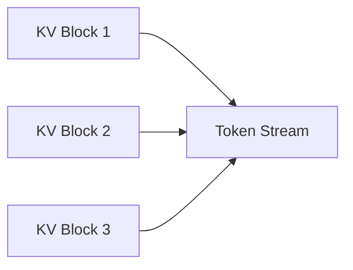

# Parallelism Techniques in AI/LLM Training & Inference
A comprehensive guide covering **all major forms of parallelism** used in large-scale deep learning systems (LLMs, Vision Transformers, MoE, HPC workloads).  
Includes: definitions, when to use, advantages/disadvantages, and Mermaid diagrams.

---

# 🌐 Overview of All Parallelism Types

Below is the full list of commonly used parallelization strategies in AI:

### **Model / Compute Parallelism**
1. **Tensor Parallelism (TP)**
2. **Pipeline Parallelism (PP)**
3. **Layer Parallelism**
4. **Operator Parallelism**
5. **Expert Parallelism (EP – MoE)**
6. **Sequence Parallelism (SP)**
7. **Context / Token Parallelism (Ulysses / Ring Attention)**
8. **Orthogonal Parallelism (OP)** — combination of dimensions
9. **FSDP (Fully-Sharded Data Parallel)** — memory sharding

### **Data & Batch Parallelism**
10. **Data Parallelism (DP)**
11. **Sharded Data Parallelism / ZeRO (Stage 1/2/3)**

### **Memory & Activation Parallelism**
12. **Activation Partitioning**
13. **Activation/Gradient Checkpointing**
14. **PagedAttention / KV-Cache Paging**

### **Pipeline-Execution Techniques**
15. **Microbatching / 1F1B pipeline schedule**
16. **Interleaved Pipeline Parallelism**

### **Hardware-Specific Parallelism**
17. **Distributed Inference Parallelism (vLLM style)**
18. **Multi-Stream GPU Parallelism**

---

# 🧩 1. Data Parallelism (DP)

Data is split across GPUs; model replica on each GPU.

### ✔ When to Use
- Model fits in one GPU
- Want throughput scaling

### 👍 Advantages
- Very easy to use  
- Linear scaling

### 👎 Disadvantages
- Model replicated on all GPUs  
- Large memory usage

---

# 🧩 2. Fully Sharded Data Parallel (FSDP / ZeRO-3)

Shards weights, gradients, and optimizer states.

### ✔ When to Use
- 30B–1T models  
- Ultra memory-efficient training

### 👍 Advantages
- Enables massive models  
- Avoids full replication

### 👎 Disadvantages
- Frequent All-Gathers  
- Lower throughput than TP

---

# 🧩 3. Tensor Parallelism (TP)

Splits **matrices inside layers** (row/column parallel).

### ✔ When to Use
- Need fast compute  
- Model layers fit per GPU  
- NVLink/NVSwitch cluster

### 👍 Advantages
- Large speedups  
- Intra-layer parallelism

### 👎 Disadvantages
- All-Reduce overhead  
- Needs fast interconnect

---

# 🧩 4. Pipeline Parallelism (PP)

Split model depth-wise.

### ✔ When to Use
- Model too deep for 1 GPU  
- Multi-node training

### 👍 Advantages
- Simple memory split  
- Works with DP+TP

### 👎 Disadvantages
- Pipeline bubbles  
- Microbatch tuning needed

---

# 🧩 5. Sequence Parallelism (SP)

Splits sequence across GPUs.

### ✔ When to Use
- Long sequences (4k–128k)
- Memory optimization with TP

### 👍 Advantages
- Reduces activation memory  
- Removes some All-Gathers

### 👎 Disadvantages
- Cross-GPU attention comm  
- More complex kernel logic

---

# 🧩 6. Expert Parallelism (EP — MoE)

Split experts across GPUs.

### ✔ When to Use
- MoE models (Mixtral, DeepSeek)

### 👍 Advantages
- Massive capacity without compute blow-up  
- Efficient sparse training

### 👎 Disadvantages
- **All-to-All** communication (very expensive)  
- Load balancing needed

---

# 🧩 7. Context Parallelism (CP)

Split long contexts across GPUs.

### ✔ When to Use
- 100k–1M token context training  
- Ring attention / Ulysses

### 👍 Advantages
- Enables ultra-long context  
- Memory-efficient

### 👎 Disadvantages
- Ring communication latency  
- Slower than standard attention

---

# 🧩 8. PagedAttention (KV Paging)

KV-cache stored in blocks.

### ✔ When to Use
- LLM inference  
- vLLM-style engines

### 👍 Advantages
- Reduces KV waste by 2–10×  
- Allows huge batch inference

### 👎 Disadvantages
- Complex runtime allocator design

---

# 🧩 Summary Table

| Parallelism | Goal | Best For | Pros | Cons |
|-------------|------|----------|------|------|
| DP | Scalability | Small/medium models | Simple | Full replication |
| FSDP | Memory | 30B–1T models | Huge memory savings | More comm |
| TP | Compute | 7B–175B models | Fast | Needs NVLink |
| PP | Depth split | Deep models | Memory efficient | Pipeline bubbles |
| SP | Sequence split | Long context | Less memory | Special kernels |
| EP | Sparse compute | MoE | High capacity | All-to-all |
| CP | Context split | 100k–1M context | Long windows | Slow |
| PagedAttention | KV memory | Inference | Efficient KV | Complex runtime |

---

# ✔ Best Combinations

- **GPT-3 scale:** DP + TP + PP  
- **LLaMA 70B:** TP + SP + FSDP  
- **MoE models:** DP + TP + EP  
- **Inference engines:** PagedAttention + CP  

---
